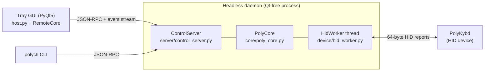
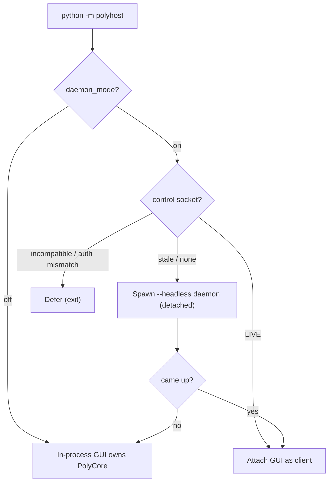
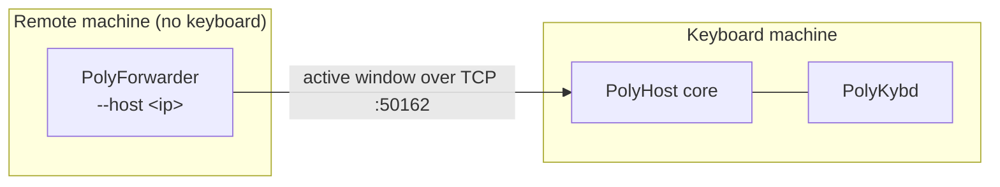

# PolyHost

Host software for the **PolyKybd** keyboard. It tracks the active window and
pushes overlay / keymap / language updates to the keyboard over HID. It can
also run as a *forwarder* that relays window info from a remote machine to the
computer the keyboard is plugged into.

## Quick install (one line)

These commands clone the repo, create a virtual environment, install the Python
requirements, and (on Linux/macOS) set up the native hidapi library and HID
permissions.

By default the app is installed into a `PolyKybdHost/` folder **in the
directory you run the command from**. The installer prints this location and
lets you type a different one (press Enter to accept the default). To pick the
location up front without the prompt, set `POLYKYBD_DIR` first — e.g.
`POLYKYBD_DIR=~/apps/polykybd` (bash) or `$env:POLYKYBD_DIR="C:\Tools\PolyKybd"`
(PowerShell).

When it finishes, the installer offers to start PolyKybd. If you ran it from a
terminal it asks first (`Start PolyKybd now? [Y/n]`); if it was launched
non-interactively it starts the app right away. Set `POLYKYBD_NO_LAUNCH=1` to
skip starting the app altogether (useful for CI/headless installs). Either way
the app registers itself for autostart on its first run, so the manual
`python -m polyhost` commands below are only needed for later/manual launches.

**Linux / macOS**

```bash
curl -fsSL https://raw.githubusercontent.com/thpoll83/PolyKybdHost/main/scripts/install.sh | bash
```

**Windows (PowerShell)**

```powershell
irm https://raw.githubusercontent.com/thpoll83/PolyKybdHost/main/scripts/install.ps1 | iex
```

Then start it:

```bash
# Linux / macOS
.venv/bin/python -m polyhost
```
```powershell
# Windows
.venv\Scripts\python.exe -m polyhost
```

> The installer scripts are plain and short — read them first if you prefer not
> to pipe a script into your shell. They live in [`scripts/`](scripts/).

## Manual install

> **Requires Python 3.10 or newer.** Create the virtual environment with a
> 3.10+ interpreter — on macOS the system `python3` from the Xcode Command Line
> Tools is 3.9 and cannot run the app (you'll get a `TypeError: unsupported
> operand type(s) for |`). Use `brew install python` (or python.org) and build
> the venv with e.g. `python3.12 -m venv .venv`.

```bash
git clone https://github.com/thpoll83/PolyKybdHost.git
cd PolyKybdHost
python -m venv .venv
# activate the venv:
#   Linux/macOS:  source .venv/bin/activate
#   Windows:      .\.venv\Scripts\activate
pip install -r requirements.txt
python -m polyhost
```

On the very first launch a small bootstrap (`polyhost/_bootstrap.py`) also
checks `requirements.txt` and installs anything still missing, so the app won't
crash with an `ImportError` if a dependency slipped through.

### Platform notes

- **Windows** — the native `hidapi.dll` ships in the repo
  (`polyhost/device/win-hidapi-0-15/`) and is loaded automatically. Nothing
  extra to install.
- **Linux** — install the native hidapi library and the udev rule for non-root
  HID access:
  ```bash
  sudo apt install libhidapi-hidraw0          # or: dnf install hidapi / pacman -S hidapi
  sudo cp polyhost/device/99-hid.rules /etc/udev/rules.d/
  sudo udevadm control --reload-rules && sudo udevadm trigger
  ```
  Replug the keyboard afterwards.
- **macOS** — `brew install hidapi`. Use a Homebrew/python.org Python 3.10+ for
  the venv (see the note above); the system `python3` is 3.9. Installing
  Homebrew's `python` also pulls binary wheels for the `pyobjc-*` frameworks
  (a transitive dependency of `PyWinCtl`), so the first `pip install` is much
  faster than compiling them against the Command Line Tools.

  **macOS permissions (one-time).** The first time you run PolyKybd, macOS will
  ask you to grant a couple of permissions in **System Settings → Privacy &
  Security** (and prompt for your password to unlock that pane). This is a
  one-time setup — it should not ask again on later launches:
  - **Input Monitoring** — the PolyKybd is a keyboard, and macOS gates raw HID
    access to keyboard-class devices behind this permission. PolyKybd needs it to
    talk to the board over HID.
  - **Accessibility** — PolyKybd types Unicode characters into the OS (the
    composition feature) and reads the active window to switch layouts; macOS
    requires Accessibility for both.

  PolyKybd does **not** auto-change your macOS *system language* by default —
  that path uses `languagesetup` with administrator rights and would prompt for
  your password on every connect. Opt in with the `macos_native_set_language`
  setting if you want it; otherwise use the keyboard's own language switching.
  If macOS asks for permissions on *every* launch (not just once), make sure you
  always start the app the same way (e.g. via the installed autostart entry), as
  macOS ties each grant to the exact launching binary.

## Running

```bash
python -m polyhost                 # normal mode (tray GUI); daemon-by-default:
                                   #   runs the core in a headless daemon and
                                   #   attaches the GUI as a client (spawning the
                                   #   daemon if needed), so the core survives
                                   #   GUI restarts
python -m polyhost --no-daemon     # legacy in-process GUI (owns the device
                                   #   directly; use for development)
python -m polyhost --daemon        # force daemon-by-default regardless of setting
python -m polyhost --debug 1       # debug logging
python -m polyhost --portable      # skip autostart registration
python -m polyhost --headless      # no GUI / no Qt — drive it with polyctl (see below)
```

Daemon-by-default is controlled by the `daemon_mode` setting (default on). The
GUI spawns/attaches the daemon; quitting the GUI leaves the daemon running
(stop it with `polyctl shutdown`).

### Forwarder mode

Run with `--host` on a *remote* machine (no keyboard attached) to relay its
active-window info to the computer the keyboard is connected to:

```bash
python -m polyhost --host IP_ADDR_OF_HOST   # or a hostname
```

On the computer with the PolyKybd connected, run without parameters and name
the remote in `overlay-mapping.poly.yaml`:

```yaml
nxplayer:
  remote: IP_ADDR_OF_REMOTE   # or NAME_OF_REMOTE
```

## Command-line control (`polyctl`)

`polyctl` is a small command-line client for controlling a running PolyKybdHost
— querying status, switching languages, pushing overlays, writing keymaps,
flashing firmware, and updating the host. It is **stdlib-only and never imports
Qt**, so it works the same whether the host is the tray GUI or a headless
service.

### How it connects

The host (GUI or headless) listens on a local **control socket** — a Unix
domain socket on Linux/macOS, a per-user named pipe on Windows — protected by
filesystem permissions and an auto-generated auth key (both under the per-user
config dir). The same socket doubles as the **single-instance lock**, so there
is always at most one host and `polyctl` always talks to that one. No ports, no
network exposure; everything is local to your user account.

`polyctl` is installed as a console script with the package (`pip install -e .`),
or run it as a module:

```bash
polyctl status
python -m polyhost.cli.polyctl status   # equivalent if the script isn't on PATH
```

You need a host running first. For a machine with no display (a server, an SSH
session, a kiosk), start one headless:

```bash
python -m polyhost --headless          # owns the keyboard, serves the socket, no GUI
```

### Commands

| Command | What it does |
|---|---|
| `polyctl status` | Print connection/device status (connected, device, language, versions). |
| `polyctl lang list` | List the language codes the keyboard supports. |
| `polyctl lang set deDE` | Switch the keyboard's active language. |
| `polyctl brightness 30` | Set keycap brightness (0–50). |
| `polyctl idle on` / `off` | Enable/disable the idle (display-off) state. |
| `polyctl overlay send a.png b.png` | Send overlay image file(s) to the keycaps. |
| `polyctl overlay enable` / `disable` / `reset` | Toggle / clear overlays. |
| `polyctl keymap layer-count` | Number of dynamic keymap layers. |
| `polyctl keymap default-layer` | Current default layer. |
| `polyctl keymap buffer` | Dump the raw keymap buffer. |
| `polyctl keymap set <layer> <row> <col> <keycode>` | Write one keycode (decimal or `0x..`). |
| `polyctl commands <file>` | Run a device-command script (one command per line). |
| `polyctl fw version` | Print the firmware version. |
| `polyctl fw flash <file.bin> [--apply]` | Upload a firmware image; `--apply` reboots into it. |
| `polyctl pause` / `resume` | Suspend / resume all device traffic. |
| `polyctl mru save` | Persist the keyboard's MRU overlay cache now. |
| `polyctl settings get <key>` | Read one settings value. |
| `polyctl settings set <key> <value>` | Set one settings value (JSON, falls back to string). |
| `polyctl update check` | Check GitHub for a newer host release. |
| `polyctl update install` | Download and apply the latest host release (restarts the host). |
| `polyctl window report --name Code.exe [--handle H] [--title T]` | Inject an active-window report into the core's remote window tracking (the control-socket path used by the forwarder feature). |
| `polyctl watch` | Stream host events (status changes, overlay activity, …) until Ctrl-C. |
| `polyctl shutdown` | Ask the host to shut down. |

### Flashing firmware

`fw flash` streams upload progress and (with `--apply`) the apply/reboot step:

```bash
polyctl fw flash ./split72_default.bin            # stage only
polyctl fw flash ./split72_default.bin --apply    # stage, then reboot into it
```

The image is validated before anything is sent (RP2040 boot2 CRC + a PolyKybd
signature), and a firmware update works even when the keyboard is on a
mismatched protocol version — exactly like the GUI's updater. The deliverable
to flash is the raw `.bin` (not the `.uf2`).

### Updating the host

```bash
polyctl update check      # "update available: 0.9.0  <url>"  or  "up to date (host 0.8.31)"
polyctl update install    # downloads, applies, then the host restarts itself
```

In headless mode the daemon re-execs into the new version automatically once the
update lands; `polyctl` reports the restart and exits.

### Streaming events

Long-running commands (`fw flash`, `update install`) print progress as it
happens. To watch everything the host emits — connection changes, overlay
sends, language switches, console output — use:

```bash
polyctl watch
```

### Exit codes & troubleshooting

`polyctl` exits `0` on success and non-zero on failure. Common cases:

- **`cannot reach PolyKybdHost … Is PolyKybdHost running?`** — no host is
  serving the socket. Start one (`python -m polyhost` or `--headless`).
- **`control protocol mismatch …`** — the `polyctl` and the running host are
  from different versions; restart the host so both match.
- **`error: <device message>`** — the device rejected the command (e.g. an
  invalid brightness value, or the keyboard is paused/disconnected).

## Autostart

On the first normal run PolyHost registers itself to start at login:

- **Windows** — a per-user **scheduled task** that triggers *at log on*,
  launching the venv windowless via `wscript` (no console flash). A logon task
  starts earlier than a Startup-folder shortcut, which Windows throttles. If
  Task Scheduler is locked down by policy, PolyHost falls back to a
  Startup-folder shortcut, so it still autostarts without admin rights.
- **Linux** — a `.desktop` autostart entry.
- **macOS** — a `launchd` agent.

The line `Autostart in place: ...` printed at startup tells you which mechanism
is active. Run with `--portable` to skip registration; if an entry already
exists from a previous run it is removed, so a portable run leaves nothing
behind.

## Architecture (developer notes)

PolyHost is split into a **Qt-free operational core** and one or more
**frontends** that drive it over a local **control socket**. The core owns the
device; a frontend is just a client. This is the "headless-core" design
(plans `H1`–`H4`).

- **Core** — [`polyhost/core/poly_core.py`](polyhost/core/poly_core.py)
  (`PolyCore`): owns the device stack, the reconnect probe, overlay/keymap/
  language commands, active-window tracking, MRU cache and brightness. It never
  imports PyQt5 and emits results as JSON-serializable events
  (`subscribe`/`emit`). All HID I/O runs on a dedicated worker thread
  ([`device/hid_worker.py`](polyhost/device/hid_worker.py)).
- **Control socket** — [`polyhost/server/`](polyhost/server): a small JSON-RPC
  protocol ([`protocol.py`](polyhost/server/protocol.py)) over the stdlib
  `multiprocessing.connection` transport (Unix socket / Windows named pipe +
  HMAC authkey), served by [`control_server.py`](polyhost/server/control_server.py).
  The same socket doubles as the single-instance lock
  ([`instance.py`](polyhost/server/instance.py)).
- **Frontends** — the PyQt5 **tray GUI**
  ([`host.py`](polyhost/host.py)), the stdlib **`polyctl` CLI**
  ([`cli/polyctl.py`](polyhost/cli/polyctl.py)), and the **`--headless` daemon**
  ([`headless.py`](polyhost/headless.py)).

### Operating modes

| Mode | How | Who owns the device |
|------|-----|---------------------|
| **Daemon + GUI client** (default) | `python -m polyhost` with `daemon_mode` on | A spawned `--headless` daemon; the GUI attaches as a [`RemoteCore`](polyhost/client/remote_core.py) client |
| **In-process GUI** | `python -m polyhost --no-daemon` | The GUI process (`PolyHost` owns `PolyCore`); it still embeds a control server for `polyctl` |
| **Headless** | `python -m polyhost --headless` | The daemon; drive it with `polyctl` (no Qt) |
| **Forwarder** | `python -m polyhost --host <ip>` | Nothing — relays the active window of a *remote* machine to the keyboard machine |

### Component view (default daemon mode)



In `--no-daemon` mode the GUI *is* the daemon box (it owns `PolyCore` + the
worker and embeds the `ControlServer`), so `polyctl` still works.

### Startup decision (daemon-by-default)

The mode is chosen in [`main_app.py`](polyhost/main_app.py) using the pure
helper in [`server/daemon_launch.py`](polyhost/server/daemon_launch.py):



### Forwarder (multi-machine)

A keyboard can follow whichever computer you're working on. The remote machine
runs a forwarder that reports its active window over TCP to the keyboard
machine; see [`forwarder.py`](polyhost/forwarder.py) and
[`handler/remote_window.py`](polyhost/handler/remote_window.py).



A control-socket `window.report` RPC (driven by `polyctl window report`) is a
newer local entry point into the same matcher; unifying the cross-machine
transport onto it is recorded as future work in
[`docs/headless-h4-plan.md`](docs/headless-h4-plan.md).

### Threading model (in short)

After startup the Qt main thread does **no** device I/O — everything HID runs on
the `HidWorker` thread (periodics: reconnect probe ~1 s, console reads ~250 ms,
daylight brightness ~10 min). The core publishes results as events; the Qt
client marshals them onto the main thread via `WorkerBridge`. Worker/core code
must never touch Qt objects. Full contract:
[`docs/hid-worker-refactor.md`](docs/hid-worker-refactor.md).

### Source map

| Concept | File |
|---------|------|
| Entry / mode selection | [`polyhost/main_app.py`](polyhost/main_app.py) |
| Operational core (Qt-free) | [`polyhost/core/poly_core.py`](polyhost/core/poly_core.py) |
| HID worker thread | [`polyhost/device/hid_worker.py`](polyhost/device/hid_worker.py) |
| Device interface | [`polyhost/device/poly_kybd.py`](polyhost/device/poly_kybd.py) |
| Tray GUI | [`polyhost/host.py`](polyhost/host.py) |
| GUI-as-client adapter | [`polyhost/client/remote_core.py`](polyhost/client/remote_core.py) |
| Control protocol (wire) | [`polyhost/server/protocol.py`](polyhost/server/protocol.py) |
| Control server | [`polyhost/server/control_server.py`](polyhost/server/control_server.py) |
| Single-instance lock | [`polyhost/server/instance.py`](polyhost/server/instance.py) |
| Daemon spawn / attach decision | [`polyhost/server/daemon_launch.py`](polyhost/server/daemon_launch.py) |
| Headless daemon | [`polyhost/headless.py`](polyhost/headless.py) |
| CLI | [`polyhost/cli/polyctl.py`](polyhost/cli/polyctl.py) |
| Active-window tracking | [`polyhost/handler/active_window.py`](polyhost/handler/active_window.py) |
| Forwarder (multi-machine) | [`polyhost/forwarder.py`](polyhost/forwarder.py) |
| Firmware-flash dialog | [`polyhost/gui/hid_fw_up_dialog.py`](polyhost/gui/hid_fw_up_dialog.py) |

### Further reading

- [`docs/headless-core-plan.md`](docs/headless-core-plan.md) — the H1–H3 design
  (extracting `PolyCore`, the control socket, `--headless`).
- [`docs/headless-h4-plan.md`](docs/headless-h4-plan.md) — H4 (GUI as a client,
  daemon-by-default, `window.report`) and the deferred follow-ups.
- [`docs/hid-worker-refactor.md`](docs/hid-worker-refactor.md) — the HID worker
  threading contract.
- [`CLAUDE.md`](CLAUDE.md) — the working dev guide (conventions, test commands,
  hard-won gotchas).

## License

PolyKybdHost is free software: you can redistribute it and/or modify it under
the terms of the **GNU General Public License** as published by the Free Software
Foundation, **either version 3 of the License, or (at your option) any later
version** (GPL-3.0-or-later). See [`LICENSE`](LICENSE) for the full text of GPL
version 3.

This project depends on PyQt5, which is licensed under the GPL v3; GPLv3 keeps
the combined work license-consistent. Moving from GPLv2-or-later to GPLv3 also
makes the project compatible with **Apache-2.0** assets (e.g. the Material
Symbols icon set), which GPLv2 is not.
