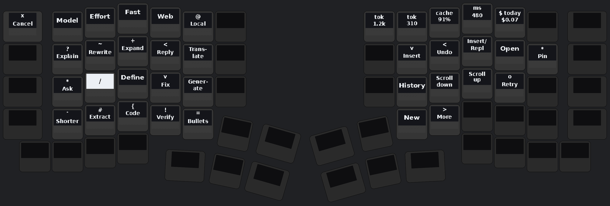

# AI integration for PolyKybd — plan + sketch

**Status: a proposal. Nothing here is implemented.** It exists to be argued with
before any code is written. Written 2026-08-20 against host 0.13.13 / firmware
0.15.7 / protocol 12.

---

## 0. The one-paragraph version

The keyboard is not where a model runs — it is where a model is *reached* and
where its state is *seen*. PolyKybdHost already holds the three things an LLM
feature needs and almost no other keyboard software has: it knows the focused
application and window (and, with the extension, the URL), it can type arbitrary
unicode into that application, and it can repaint 72 keycaps in ~100 ms. So the
proposal is three features that each use a different one of those, sharing one
provider layer: **prompt keys** (a layer where each keycap is an action on your
selection), **auto-generated keycap legends** (a model writes the overlay set for
an app nobody has drawn one for yet), and an **agent surface** (a local MCP server
that lets an agent already running on the machine use the keyboard as its status
display and its prompt).

## 1. What this is NOT

- **Not on-device inference.** The RP2040 runs at 200 MHz with ~264 KB of SRAM
  and a 2 MB firmware partition of which `split72:default` uses ~0.76 MB. Nothing
  resembling a model fits, and nothing should be attempted there. Every AI feature
  is host-side; the firmware's job is display and input, exactly as today.
- **Not a chat window.** If the answer wants a scrollback and a conversation, the
  user has a browser two keystrokes away. What the keyboard is good at is the
  *one-shot verb on the thing I have selected*, and showing state without stealing
  focus.
- **Not a new transport.** Every device interaction below rides commands that
  already exist, except one small polling command in §4.
- **Not a reason to weaken the device surface.** No model output ever becomes a
  device command; see §8.

---

## 2. Three pillars

### A. Prompt keys — *the keyboard as a verb palette*

A dedicated `_AI` layer. Each keycap is one action applied to the current
selection: Explain, Summarise, Rewrite, Fix, Translate, Extract, Verify… Press
one, the host grabs the selection, runs the action, and streams the answer into a
small window near the cursor (typing it into the app is a **second, explicit**
key — see §8).

The two things that make this better on a PolyKybd than as a global hotkey:

1. **The legends are contextual.** The host already knows the focused app, so the
   same physical key means "Explain code" in an editor, "Draft reply" in a mail
   client, "Alt-text" in a design tool. On any other keyboard that ambiguity is
   why such a layer is unusable; here the keycap just says which one it is.
2. **Translate needs no target menu.** The keyboard already carries an active
   language layer (`xx-YY`, 156 of them). "Translate" means "into the language the
   keyboard is currently set to". Switching target language is a thing the user
   already knows how to do, on a key they already have.




Both pictures are rendered by `tools/ai_layer_demo.py` from
`docs/sketches/ai-layer.yaml` onto the real split72 geometry (KLE + `keyboard.json`
+ the `[_L0]` keymap), so the layout in the picture is the layout on the hardware.
Edit the YAML, re-run the tool, and this document's picture and table stay in
step. The YAML is the source of truth for the proposal — the abbreviated table:

| Cluster | Keys | What |
|---|---|---|
| verbs (left) | `Q W E R T` / `A S D F G` / `Z X C V B` | Explain · Rewrite · Expand · Reply · Translate / Ask · Summarise · Define · Fix · Generate / Shorter · Extract · Code · Verify · Bullets |
| run controls (left number row) | `Esc 1 2 3 4 5` | Cancel · Model · Effort · Fast mode · Web search · Local-only |
| answer controls (right) | `Y U I O P` / `H J K L` / `N M` | Insert · Undo · Insert-vs-Replace · Open · Pin / History · Scroll · Retry / New · More |
| status (right number row) | `6 7 8 9 0` | tokens in · out · cache-read share · time-to-first-token · spend today |

The status row is not decoration: `cache` reading 0 means the prompt prefix broke
(§7), and `$ today` against the cap is the thing that stops a runaway from being
discovered on a statement.

### B. Auto-generated keycap legends — *the model draws the overlay set*

Today an app gets keycap overlays because a human researched its shortcuts,
sourced an icon per shortcut, and ran `scripts/generate_app_overlays.py`. That
script already does everything mechanical: resolve `(key, mods)` to a grid cell
and colour channel, render the icon to a 1-bit 72×40 stamp, split across the
primary/combo PNGs, emit the `overlay-mapping.poly.yaml` stanza and a preview
contact sheet. The human part is *sourcing the shortcut list* — which is exactly
a model's job.

So: when the focused app matches no entry, offer to generate one.

```
unknown app  ->  structured-output request: [{key, mods, action, icon_hint}, ...]
             ->  icon_hint mapped onto the vendored Material Symbols set
             ->  binding YAML  ->  generate_app_overlays.py  (unchanged)
             ->  preview sheet + shortcut table  ->  HUMAN ACCEPTS  ->  user overlay dir
```

Four things this must get right:

- **Never auto-install.** A model that is confidently wrong about a shortcut
  produces a keycap that *lies*, which is worse than a blank one — the user
  presses it believing the picture. The review gate is the feature, not friction.
- **Structured outputs, not prose parsing.** `output_config={"format": …}` with a
  schema (and `strict: true` on any tool), so the binding file is validated at the
  API layer rather than regexed out of a paragraph.
- **Write to a user directory**, never `polyhost/res/overlays/` — that ships with
  the app and is replaced on update (the self-updater copies release files over
  the tree; see the note in CLAUDE.md).
- **Use the Batch API.** This is the textbook non-latency-sensitive workload: 50%
  cost, and a queue of twelve apps can be generated overnight. A generation is a
  file on disk, so it costs once, ever.

Icon sourcing keeps the existing rule: Material Symbols at **optical size 48**
(`_48px.svg`), because a mixed-opsz set renders visibly uneven — an opsz24 file
carries ~25% more ink on the same canvas.

### C. Agent surface — *let the agent already running use the keyboard*

The inverse direction, and the cheapest of the three to build. A local MCP server
(`polykybd`) exposing a handful of tools to any agent on the machine:

| Tool | Effect |
|---|---|
| `keyboard.notify(state, label)` | status OLED / RGB: running · needs input · done · failed |
| `keyboard.progress(pct, label)` | a progress bar on a keycap, or the status OLED |
| `keyboard.set_keycap(key, text)` | one keycap becomes a labelled button |
| `keyboard.ask(question, options)` | **the keycaps become the answer buttons**, and the pressed one is returned |

`keyboard.ask` is the one worth building the rest for. An agent that needs a
decision currently has to steal focus or wait unread in a terminal; here the
choices appear under your fingers, on keys that say what they do, without a window
appearing over what you are reading. It needs the same key-event path as pillar A
(§4), so the two share their only firmware dependency.

Security posture is the existing one for local servers, and it is not optional:
the MCP server holds **no `PolyCore` reference** — only injected callbacks — the
same way `WindowReportServer` and `BrowserReportServer` do, so it can never reach
device control, flash, or the bootloader.

---

## 3. Where the code goes

Everything Qt-free, under `polyhost/services/ai/`, reached through `PolyCore` like
every other capability:

```
polyhost/services/ai/
    providers/base.py       Provider protocol: stream(request) -> deltas + a usage record
    providers/anthropic.py  official `anthropic` SDK, lazily imported
    providers/openai.py     official `openai` SDK, lazily imported
    providers/local.py      Ollama / LM Studio (OpenAI-compatible surface)
    providers/mock.py       deterministic, no network — what the tests use
    runner.py               the AI job thread, cancellation, streaming, accounting
    actions.py              the action registry + per-app overrides
    context.py              what may be sent, as an allow-list
    budget.py               per-run and per-day caps, token counting
    secrets.py              key storage (see §8 — NOT settings.yaml)
polyhost/res/ai/actions.yaml    the shipped action registry
```

Surfaces, following the shape every other feature already has:

- `PolyCore.ai_*` methods returning `(ok, payload)`, emitting `ai_progress` /
  `ai_done` core events (`polyhost/core/events.py`) — the flash-progress pattern.
- `M_AI_*` control-socket methods + a `RemoteCore` mirror, so the tray works in
  `--connect` client mode.
- `polyctl ai ask|run|actions|budget|providers`, streaming to the terminal via the
  existing `subscribe_events()`.
- A tray **AI** submenu, developer-gated until it settles.

### Threading — the one rule that matters

**No AI call ever runs on the `HidWorker`.** Its single thread owns the device; a
20-second streaming request there would block the reconnect probe, every overlay
send, and the console read — the same rule that already forces `UpdateChecker` and
`FwUpDownloader` onto their own threads, one level further out. The AI runner owns
its own thread; only the short device pokes it produces (a ROI spinner frame, an
overlay swap) go back through `worker.submit(..., coalesce_key="ai_feedback")`, so
a slow stream cannot queue up a hundred stale repaints.

### Why the official SDKs, not hand-rolled HTTP

Adding `requests`-based SSE parsing looks lighter and is not: streaming frame
shapes, retry/backoff on 429 and 5xx, typed errors, prompt-cache fields, refusal
handling and server-side fallbacks all arrive free and correct in the vendor SDKs
and all have to be maintained by hand otherwise. They go in an **optional extra**
(`pip install polykybd-host[ai]`) and are **imported lazily inside the provider**,
so a user who never enables AI pays nothing at startup and the daemon's import
time is untouched. Never reach for an OpenAI-compatible shim to talk to Anthropic
— each provider adapter uses its own vendor SDK.

---

## 4. The trigger problem — how the host learns a key was pressed

This is the only genuinely new mechanism, and it is worth being precise about
because the obvious answers are wrong.

Today the keyboard **cannot tell the host anything**. Raw HID here is strictly
request/response: all 45 `raw_hid_send()` call sites live in `hid_com.c`, inside
the `raw_hid_receive()` dispatch — every one of them is a reply to something the
host asked for. Cmd 14 (`KEYPRESS`) runs the *other* direction — the host makes
the keyboard type — and is `debug_enable`-gated precisely because it is a
keystroke-injection primitive.

| Option | Cost | Verdict |
|---|---|---|
| **a. Ordinary keycodes (F13–F24) + a global `pynput` listener** | none in firmware | **Prototype only.** The app never shipped an input *listener*, only injection; on macOS it needs Input Monitoring (a keylogger-shaped grant) and the keystroke still reaches the focused app. |
| **b. Firmware event queue, polled by the host** | one HID command, protocol 13 | **Recommended.** No OS input permission, no stray keystroke, works headless. |
| **c. Unsolicited `raw_hid_send` from the firmware** | protocol + host read-loop changes | **No.** It lands in the same read queue as command replies, and stale replies are a documented, already-paid-for class of bug here — protocol v3 made cmd 21 silent to *reduce* exactly that. |

Sketch of (b) — a ring buffer the host drains:

```c
case 34: // GET_EVENT (protocol v13) — drain the user-event queue
    // reply: 'P' 0x22 '.' [count] then count * {type, kc_hi, kc_lo, flags}
    // The queue only fills while a KC_HOST_EVENT keycode is pressed, so a
    // keyboard nobody has put on the AI layer queues nothing and costs nothing.
```

Host side it is a periodic on the existing model: the console read already runs
every 250 ms on the worker. The event poll joins it at 250 ms normally and **60 ms
while a host-event layer is active** — the keyboard's own press feedback (the
firmware inverts the pressed keycap in `matrix_scan_kb`) covers the perceptual gap
so the poll interval is not the felt latency.

⚠️ Whatever it renders, do **not** drive latched state through `kdisp_invert()` —
that panel-level toggle is undone by the next keypress. A latched indicator is
*rendered* inverted (`kdisp_set_buffer(0xFF)` + erase-mode glyph), gated on synced
state so the slave half follows.

---

## 5. Feedback on the keyboard — what is free and what is not

| Feedback | Mechanism | Firmware change? |
|---|---|---|
| pressed-key flash | `matrix_scan_kb` already inverts on press | none |
| per-key spinner / progress while streaming | ROI partial refresh (cmds `0x12`/`0x13`) on that one keycap | none |
| relabel the whole layer per app | the ordinary overlay path (`0x10`/`0x11` + mapping `21`/`33`) | none |
| status-OLED line ("opus-5 · 1.2k tok · $0.07") | **no host command exists** — the 128×64 screen is composed entirely in firmware | new command + a measured layout slot |
| RGB colour while a request runs | `rgb_matrix_indicators_kb` already does this for flashing (cyan/orange) | small |

So pillars A and C are reachable with **zero firmware change beyond the event
queue**, and the status OLED is a later nicety rather than a prerequisite. If it
is built: space the rows with `keyboards/polykybd/.claude/skills/status-oled-layout/measure_bands.py`
rather than by eye, and check the worst case (a 3-digit token count and the
longest model name), not the happy fixture.

---

## 6. Model, latency and cost

Defaults, from the current model line-up:

| Model | Input / output per MTok | Where it fits |
|---|---|---|
| `claude-opus-5` | $5.00 / $25.00 | **the default** for every action |
| `claude-sonnet-5` | $3.00 / $15.00 | the Model key's next stop |
| `claude-haiku-4-5` | $1.00 / $5.00 | the Model key's last stop, for Fix/Shorter-class edits |

Trading capability down for cost or speed is a **user** decision, which is why it
is a key on the layer and not a hardcoded per-action choice. Levers, in the order
worth reaching for:

- **`output_config.effort`** (`low` … `max`) is the real latency dial and the
  `Effort` key. Leave adaptive thinking on and lower effort: disabling thinking on
  Opus 5 has two documented failure modes (a tool call written into visible text;
  leaked `<thinking>` tags) and saves less than dropping effort does.
- **`max_tokens` deliberately small** per action (a "Fix" answer is never 4k
  tokens). One of the few sanctioned reasons to cap it hard.
- **Fast mode** (`speed="fast"`, beta `fast-mode-2026-02-01`, Opus 5 / 4.8 only) is
  up to ~2.5× output throughput at premium rates ($10/$50) — the `Fast` key, off
  by default, because "the keyboard felt slow" is the failure mode that kills a
  feature like this and the user should be able to buy their way out of it for one
  run.
- **Prompt caching** on the stable prefix (system prompt + action registry). The
  minimum cacheable prefix is ~1024 tokens, so this only pays once the registry is
  real — and `usage.cache_read_input_tokens` reading 0 across runs means something
  volatile (a timestamp, an unsorted dict) got into the prefix. That is the `cache`
  status key's whole reason to exist.
- **Refusal fallbacks** on Opus 5 (`betas=["server-side-fallback-2026-07-01"]`,
  `fallbacks="default"`): a policy decline mid-action would otherwise just stop
  with nothing on the keycap.
- **`messages.count_tokens`** for the pre-run budget preview — never a local
  tokenizer estimate.

Latency budget for a press to feel connected: spinner on the keycap **< 150 ms**
(host-side, no model involved), first token **< 1.5 s**. The keycap flash is
instant because the firmware does it without asking anyone.

---

## 7. Configuration

New settings, all defaulting to off/conservative (`polyhost/settings.py`):

```yaml
ai_enabled: false               # master switch; everything below is inert until true
ai_provider: anthropic          # anthropic | openai | local
ai_model: claude-opus-5
ai_effort: medium
ai_fast_mode: false
ai_send_window_title: false     # app name is sent; the TITLE is opt-in (it can name a document)
ai_send_selection: true         # only ever on an explicit key press
ai_daily_budget_usd: 2.00       # hard stop, not a warning
ai_max_tokens: 1024             # per run
ai_auto_overlays: false         # pillar B, review-gated even when true
ai_mcp_server_enabled: false    # pillar C
```

API keys are **not** among them — see below.

---

## 8. Security and privacy

This is the section to read twice. The features above put a network client next to
a keystroke-injection path and a window-title stream, which is a combination worth
being paranoid about.

1. **Off by default, opt-in per pillar.** No AI request is ever made by a host
   the user has not deliberately switched on.
2. **The payload is an allow-list, built and reviewed like the telemetry one.**
   Selection text, app name, and (opt-in) window title — copied field by field,
   never a spread of a status dict, with a frozen-keys test. The host sees window
   titles constantly; nothing else may ride along.
3. **Never keystrokes.** The app has no key logger and must not grow one — which
   is also the strongest argument for the firmware event queue (§4) over a global
   `pynput` listener.
4. ⚠️ **API keys must NOT live in `settings.yaml`.** That file is collected into
   support bundles (`log_bundle.py` ships a redacted copy) and attached to public
   GitHub issues by "Report a Problem". Keys go in the OS keyring where available,
   else a separate `0600` file beside the config — **and** a redaction rule plus a
   test are added regardless, because defence in depth is cheap here and a leaked
   key is not.
5. **Model output is data, never a command.** The only sink is text typed into the
   focused app, and only on a *second, explicit* key (`Insert`). No AI-selected
   device command, no shell, no flash, no bootloader — and the debug-gated cmd 14
   keystroke-injection primitive stays gated and unused by this feature; typing
   goes through the existing host-side input helpers.
6. **Assume prompt injection.** The input is a selection or a window title, i.e.
   text an attacker may control (a web page, a received email). That is precisely
   why the default target is a preview window rather than the document, and why no
   output path may execute anything.
7. **Local-only mode is a first-class option**, not a footnote: the `Local` key
   routes to Ollama/LM Studio, and users who will not send text to a cloud get the
   feature with no asterisk.
8. **No new telemetry.** The telemetry payload's key list is frozen by a test on
   purpose; AI counters would need a deliberate widening plus a docs change, and
   the first release should not ask for that.
9. **Do not cite firmware signing as cover.** FW-9 is open: the resource region
   takes unsigned executable code over the same HID transport. Nothing here should
   touch that path, and no user-facing text should imply the device is closed.

---

## 9. Testing

- **A `MockProvider` is the default in tests** — deterministic, no network,
  scriptable failures (refusal, rate limit, mid-stream cancel). Same role as
  `poly_kybd_mock.py` and the rig's `FakeProfilerDevice`. A test that needs an API
  key is not a test.
- **Pin the action registry with a schema test**: every action resolves a prompt,
  a model, a `max_tokens` and a target, and every per-app override names a key
  that exists on the layer. The renderer already fails loudly when
  `ai-layer.yaml` names a key that is not on `[_L0]`.
- **Run the real CLI once before believing the suite.** A mocked suite is only as
  right as the fixtures; `polyctl ai ask` against the mock provider in a temp dir,
  and once against a real key by hand, catches the shapes fixtures cannot.
- **HIL**: the event-queue command needs a rig test gated `min_protocol: 13`, so a
  keyboard that predates it *skips* rather than reddening the board.
- ⚠️ After adding tests, check the reported **count** changed — not just that the
  suite is green.

---

## 10. Rollout

| Phase | Deliverable | Device needed? |
|---|---|---|
| **P0** | provider layer + mock + budget + `polyctl ai ask` streaming to stdout | no |
| **P1** | prompt keys via F13–F24 + a listener on one OS; result in a window; ROI spinner | yes |
| **P2** | firmware event queue (protocol 13) + `KC_HOST_EVENT`; drop the listener; per-app legends | yes |
| **P3** | auto-overlay forge with the review gate + Batch API | yes |
| **P4** | MCP agent surface (`keyboard.ask`), status-OLED host line | yes |

P0 is worth doing on its own even if the rest is never built: it is the whole
provider/budget/secret surface, it is testable with no hardware, and it makes the
question "is this actually useful?" answerable for the price of an afternoon.

**P2 is the commitment point** — a protocol bump means `PROTOCOL_VERSION`,
`__protocol__`, a `FEATURE_MIN_PROTOCOL` entry, a rig test and a host release
ordered before the firmware release. Don't start it until P1 has been lived with.

---

## 11. Open questions

1. **Which key enters `_AI`?** The sketch assumes `MO(_AI)` on a right inner
   thumb. Every thumb is spoken for; this is a layout decision, not a code one.
2. **Should `Insert` ever be the default target** for a low-risk action like Fix,
   or does everything land in the preview window first? (I lean: preview always,
   until the feature has been used for a month.)
3. **Who owns the action registry?** Shipped-and-fixed, user-editable YAML, or
   both with an override file — and does a per-app override ship with the app the
   way overlay mappings do?
4. **BYO key, or a hosted proxy?** BYO for P0–P2, no question. A proxy is a
   service with a bill and an abuse surface; only worth it if this becomes a
   product feature rather than a power-user one.
5. **Does `_AI` reuse the emoji layer's tab/paging machinery** for more than ~20
   actions, or is one flat layer the point?
6. **Which pillar first?** They are independent. A is the demo, B is the one that
   makes every *existing* PolyKybd better overnight, C is the cheapest.
